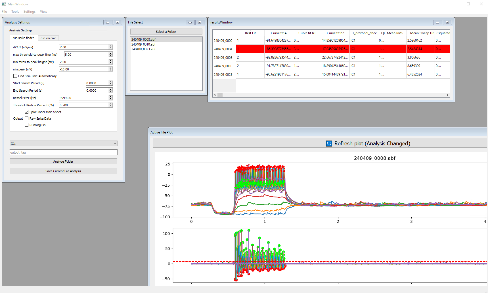

# pyAPisolation
This package facilitates batch feature extraction and data dashboarding of ABF files. Primarily written for Inoue Lab @ western university. The package is able to output feature arrays and/or raw current traces from the file(s). The module piggy backs off of some of the excellent work found in the pyABF & ipfx packages.

### Installation
It is recommended to install pyAPIsolation into its own [conda](https://www.anaconda.com/) environment.  
This can be accomplished with the command:   
`conda create -n pyAPisolation python=3.9 -y`  
Then install the package:  
`conda activate pyAPisolation && pip install   git+https://github.com/smestern/pyAPisolation`  

pyAPIsolation uses IPFX on the backend. Occasionally, this install will fail due to strict requirements on the Allen Institute's end. If this occurs. Run the command:

`pyAPisolation_setup`  

Within the environment to force the installation of ipfx.
