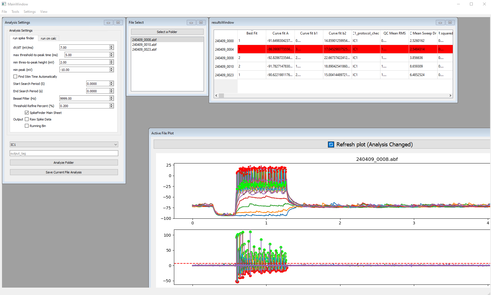

# gigaseal

A Python package for batch electrophysiology feature extraction, analysis, and visualization of ABF files. Built for the Inoue Lab @ Western University.



> **Authoring policy (soft target).** Core analysis code: spike detection, subthreshold fits, IPFX integration, lab-specific protocol logic, is written by a human. AI assistants are used for frameworking, generalization, plumbing, tests, and cleanup. See [COPILOT_PRIORITIES.md](COPILOT_PRIORITIES.md) for the current backlog and division of labor.

## Features

- **Spike Detection & Analysis**: Automated spike detection using IPFX with customizable parameters (dV/dt cutoff, height thresholds, etc.)
- **Subthreshold Analysis**: Membrane resistance, capacitance, sag, resting membrane potential, and more  
- **Batch Processing**: Process entire directories of ABF files with parallel execution support
- **Quality Control**: Automated QC metrics including RMS noise and Vm drift detection
- **Machine Learning**: UMAP/t-SNE dimensionality reduction, clustering, and outlier detection
- **Desktop GUI**: PySide6-based application for interactive analysis and visualization
- **Web Visualization**: Flask-based dashboard for data exploration and sharing
- **Multiple Export Formats**: CSV, Excel, and Prism-compatible outputs

## Installation

### Requirements

- Python 3.11+
- Conda (recommended)

### Basic Installation

Create a dedicated conda environment:

```bash
conda create -n gigaseal python=3.11 -y
conda activate gigaseal
pip install git+https://github.com/smestern/gigaseal
```

### Installation Options

Install with optional dependencies based on your needs:

```bash
# GUI application (PySide6, pyqtgraph)
pip install "gigaseal[gui] @ git+https://github.com/smestern/gigaseal"

# Web visualization (Flask, anndata)
pip install "gigaseal[web] @ git+https://github.com/smestern/gigaseal"

# Machine learning features (scikit-learn, UMAP)
pip install "gigaseal[ml] @ git+https://github.com/smestern/gigaseal"

# Full installation (all features)
pip install "gigaseal[full] @ git+https://github.com/smestern/gigaseal"
```

### Troubleshooting

If IPFX installation fails due to strict requirements, run:

```bash
gigaseal_setup
```

### GUI Application

Launch the desktop GUI (requires `[gui]` installation):

```bash
spike_finder
```

## Supported File Formats

- **ABF** (Axon Binary Format) - Primary format via pyABF
- **NWB** (Neurodata Without Borders) - Via IPFX

## Analysis Parameters

Key parameters for spike detection:

| Parameter | Default | Description |
|-----------|---------|-------------|
| `dv_cutoff` | 7.0 | Minimum dV/dt to detect spike (mV/ms) |
| `min_height` | 2.0 | Minimum spike height (mV) |
| `min_peak` | -10.0 | Minimum voltage at spike peak (mV) |
| `max_interval` | 0.005 | Max interval between peaks (s) |
| `bessel_filter` | -1 | Bessel filter cutoff Hz (-1 = disabled) |
| `thresh_frac` | 0.2 | Fraction of spike height for threshold |

## Project Structure

```
gigaseal/
├── featureExtractor.py  # Core spike analysis
├── patch_subthres.py    # Subthreshold analysis
├── patch_ml.py          # ML/clustering utilities
├── dataset.py           # Data container classes
├── QC.py                # Quality control metrics
├── cli.py               # Command line interface
├── gui/                 # PySide6 GUI application
└── webViz/              # Flask web visualization
```

## Dependencies

**Core**: numpy, pandas, scipy, matplotlib, pyabf, h5py, ipfx

**Optional**:
- GUI: PySide6, pyqtgraph, prismWriter, seaborn
- Web: Flask, beautifulsoup4, pyyaml, anndata
- ML: scikit-learn, umap-learn, joblib

## License

See [LICENSE](LICENSE) for details.

## Acknowledgments

This package builds on the excellent work of:
- [pyABF](https://github.com/swharden/pyABF) - ABF file reading
- [IPFX](https://github.com/AllenInstitute/ipfx) - Intrinsic Physiology Feature Extraction (Allen Institute)

